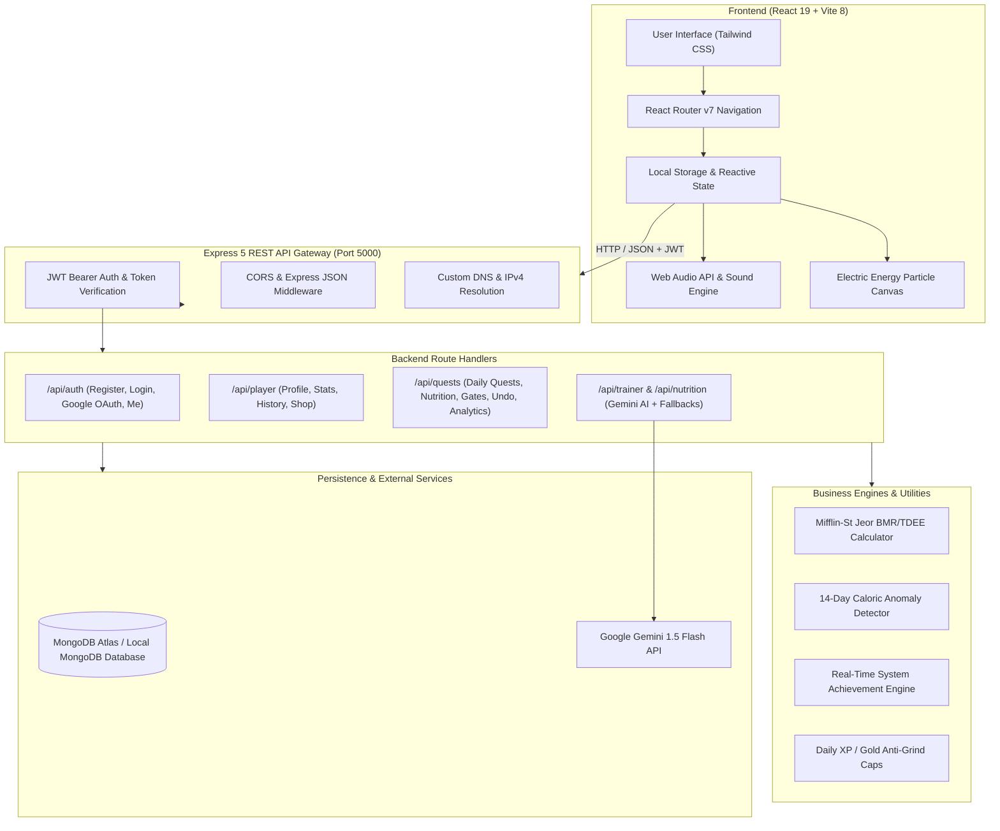
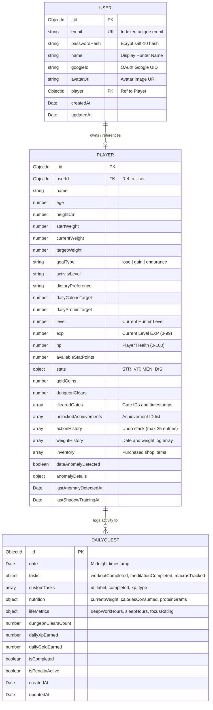
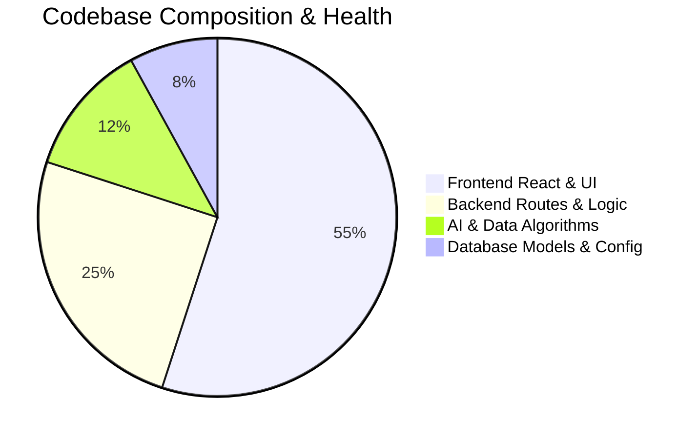

# 🛡️ Solo System — Comprehensive Project Audit Report & System Blueprint

> **Project Name:** Solo System (Solo Leveling Gamified Fitness & System Tracker)  
> **Repository:** `solo-system-tracker`  
> **Audit Date:** August 2026  
> **Report Version:** 1.0.0 (Production Release Audit)  
> **Target Audience:** Developers, System Architects, Stakeholders, and Project Collaborators  

---

## 📑 Table of Contents

1. [Executive Summary](#1-executive-summary)
2. [High-Level Architecture & Tech Stack](#2-high-level-architecture--tech-stack)
3. [Core Feature Breakdown & Gameplay Mechanics](#3-core-feature-breakdown--gameplay-mechanics)
4. [Mathematical Formulas, Algorithms & Mechanics](#4-mathematical-formulas-algorithms--mechanics)
5. [Database Architecture & Data Models](#5-database-architecture--data-models)
6. [API Specification & Endpoint Catalog](#6-api-specification--endpoint-catalog)
7. [Frontend Component & State Architecture](#7-frontend-component--state-architecture)
8. [AI Integration & Fallback Subsystems](#8-ai-integration--fallback-subsystems)
9. [Audio & Visual Effects Engine](#9-audio--visual-effects-engine)
10. [Comprehensive Audit Findings & Quality Assessment](#10-comprehensive-audit-findings--quality-assessment)
11. [Security, Performance & Scalability Analysis](#11-security-performance--scalability-analysis)
12. [Local Setup, Environment Configuration & Deployment](#12-local-setup-environment-configuration--deployment)
13. [Future Roadmap & Recommended Enhancements](#13-future-roadmap--recommended-enhancements)

---

## 1. Executive Summary

**Solo System** is a full-stack, dark-fantasy gamified fitness, nutrition, and daily habit tracking web application inspired by the manhwa/anime *Solo Leveling*. The platform bridges the gap between gamification and real-world behavioral psychology by converting personal health metrics (body weight, calories, macronutrients, deep work hours, sleep quality, and daily exercise) into RPG mechanics (Level, Experience Points, Stat Allocation, Hunter Ranks, Shadow Army Power, Gate Raids, and System Titles).

### Key Highlights
- **Full-Stack Decoupled Architecture:** Express 5.x / Node.js backend with MongoDB Mongoose and React 19 / Vite frontend.
- **Multimodal AI Coaching:** Integration with Google Gemini API (`gemini-1.5-flash`) for personalized fitness guidance and exact gram-scale macro food analysis, backed by a deterministic heuristic fallback engine.
- **Dual-Layer Anti-Exploit & Anomaly Detection:** 14-day rolling window energy balance anomaly detection against metabolic baseline ($7700\text{ kcal/kg}$ deficit rule) and daily reward caps (300 XP, 500 Gold).
- **Zero-Latency State Synchronization:** Optimistic UI updates with Web Audio API sound synthesis and server-authoritative state reconciliation.

---

## 2. High-Level Architecture & Tech Stack



### Technology Matrix

| Layer | Technology | Version | Purpose |
| :--- | :--- | :--- | :--- |
| **Frontend Framework** | React | `^19.2.8` | UI Component Hierarchy & Rendering |
| **Build Tooling** | Vite | `^8.2.0` | Ultra-fast HMR and bundle compilation |
| **Routing** | React Router DOM | `^7.18.2` | Single Page Application client-side navigation |
| **Styling** | Tailwind CSS / PostCSS | `^3.4.19` / `^4.3.3` | Cyberpunk / Dark Fantasy HUD styling |
| **OAuth** | `@react-oauth/google` | `^0.13.5` | Google Identity Services OAuth integration |
| **Backend Runtime** | Node.js | `>=18.x` | Asynchronous JavaScript Server Runtime |
| **Web Framework** | Express.js | `^5.2.1` | Next-generation REST API routing & middleware |
| **Database** | MongoDB / Mongoose | `^9.9.1` | NoSQL document persistence & object modeling |
| **Authentication** | JSON Web Tokens (`jsonwebtoken`) | `^9.0.3` | Stateless Bearer token authentication |
| **Password Security**| `bcryptjs` | `^3.0.3` | Salted 10-round password hashing |
| **AI Intelligence** | `@google/generative-ai` & REST | `^0.24.1` | Gemini 1.5 Flash LLM context-aware assistant |
| **Networking** | CORS & native DNS | `^2.8.6` | Cross-origin access & IPv4 DNS stabilization |

---

## 3. Core Feature Breakdown & Gameplay Mechanics

### 1. Hunter Master Profile & Stat Allocation
- **Primary Attributes:**
  - **STR (Strength):** Boosted via physical workouts and heavy compound training. Increases physical damage output against raid bosses.
  - **VIT (Vitality):** Boosted via nutrition logging and adequate hydration. Enhances HP and penalty resistance.
  - **MEN (Mentality):** Boosted through daily meditation, mindfulness, and cognitive focus habits.
  - **DIS (Discipline):** Boosted through habit consistency and deep work blocks.
- **Leveling & Stat Points:**
  - Users earn Experience Points (XP) from quest completions.
  - Every 100 XP triggers a Level Up, granting **+3 Free Stat Points**.
  - Stat points can be allocated manually to STR, VIT, MEN, or DIS with real-time stat calculation.

### 2. Hunter Rank & Title Ascension System
The system automatically calculates rank and title based on current level:
- **E-Rank Novice (Lvl 1–4):** Weakest Weapon of Mankind ($+0\%$ XP Buff)
- **D-Rank Veteran (Lvl 5–9):** Raid Member ($+2\%$ XP Buff)
- **C-Rank Striker (Lvl 10–19):** Elite Striker ($+5\%$ XP Buff)
- **B-Rank Elite Hunter (Lvl 20–34):** Guild Master ($+10\%$ XP Buff)
- **A-Rank High Hunter (Lvl 35–49):** National Contender ($+15\%$ XP Buff)
- **S-Rank Iron Sovereign (Lvl 50+):** Supreme Monarch ($+25\%$ to $+50\%$ XP Buff based on Prestige Tier)
- **National Level Monarch (Lvl 100+):** Infinite Prestige Tier Progression

### 3. Daily Quest Engine & Habit Tracking
- **Core Triad Objectives:**
  1. *Complete a Workout:* $+30\text{ XP}, +20\text{ Gold}, +1\text{ STR}$.
  2. *Daily Meditation:* $+20\text{ XP}, +20\text{ Gold}, +1\text{ MEN}$.
  3. *Track Daily Macros:* $+15\text{ XP}, +50\text{ Gold}, +1\text{ VIT}$.
- **Recurring vs. One-Time Tasks:**
  - Tasks marked as `daily` automatically carry over to new days upon midnight transition.
  - Tasks marked as `today` are one-shot tasks that archive after completion.
- **Penalty Zone Mechanics:**
  - Failing daily objectives can trigger the Penalty Zone, reducing HP by $-25\text{ HP}$ with visual alarms.
  - Clearing all daily objectives restores HP to full ($100\text{ HP}$) and clears penalties.

### 4. Boss Raids & Instant Gate Dungeons
- **Iron Colossus Boss Raid:**
  - Boss HP ($100\text{ HP}$) decreases dynamically based on daily task completion percentage, equipped gear attack bonus ($+10\text{ ATK}$ per item), and Shadow Army multipliers ($+5\%$ damage per active shadow).
- **Ranked Gate Dungeons:**
  - *Goblin Cavern Gate (E-Rank):* Requires $2+\text{ hours}$ of Deep Work ($\text{Loot: }+150\text{ XP}, +100\text{ Gold}$).
  - *Cerberus Den Gate (D-Rank):* Requires 3-day protein adherence ($\text{Loot: }+300\text{ XP}, +250\text{ Gold}$).
  - *Red Gate Survival (C-Rank):* Requires 5-day consecutive habit streak ($\text{Loot: }+500\text{ XP}, +500\text{ Gold}$).
  - Double-claim prevention ensures gates can only be rewarded once per player.

### 5. Shadow Training Grounds (Micro-Quests)
- Fast, actionable 15-minute micro-habits (e.g., 20 pushups, 500ml water, 10 min stretching).
- Soft 15-minute cooldown timer prevents spamming while rewarding steady micro-discipline ($+10\text{ XP}, +5\text{ Gold}$).

### 6. System Shop & Gold Economy
- Hunters earn Gold Coins from quests, weight logging, deep work, and dungeons.
- Items available in the System Shop:
  - **Cheat Meal Pass (1,000 Gold):** Waives streak penalty for a scheduled off-diet meal.
  - **Rest Day Pass (500 Gold):** Waives daily workout requirement for 24h.
  - **Iron Sovereign Aura Theme (2,500 Gold):** Unlocks a dynamic violet shadow energy particle theme across the entire interface.

### 7. Real-Time Action Undo Capability
- Full audit log (`actionHistory`) tracks the last 25 player actions.
- The **Undo Last Action** feature allows users to revert accidental clicks, rolling back XP, level, gold, stat points, and quest completions with exact arithmetic precision.

---

## 4. Mathematical Formulas, Algorithms & Mechanics

### 1. Basal Metabolic Rate (BMR) & Total Daily Energy Expenditure (TDEE)
The system calculates BMR using the standardized **Mifflin-St Jeor Equation**:

$$\text{BMR} = 10 \times \text{Weight (kg)} + 6.25 \times \text{Height (cm)} - 5 \times \text{Age (years)} + 5$$

TDEE is derived using validated physical activity multipliers:

$$\text{TDEE} = \text{BMR} \times \text{Activity Multiplier}$$

| Activity Level | Multiplier | Description |
| :--- | :--- | :--- |
| `sedentary` | `1.200` | Desk job, little to no exercise |
| `light` | `1.375` | 1–3 days light exercise / walking |
| `moderate` | `1.550` | 3–5 days moderate training |
| `active` / `very` | `1.725` | 6–7 days hard workouts |
| `extreme` | `1.900` | 2x daily intense athletic conditioning |

### 2. Goal Calorie & Protein Calculation
- **Fat Loss (`lose`):** $\text{Target} = \max(1200, \text{TDEE} - 500\text{ kcal})$
- **Muscle Bulk (`gain`):** $\text{Target} = \text{TDEE} + 350\text{ kcal}$
- **Endurance/Maintenance (`endurance`):** $\text{Target} = \text{TDEE}$
- **Protein Target:**
  - *High-Protein / Bulk / Keto:* $\text{Protein} = 2.2 \times \text{Weight (kg)}$
  - *Standard Balanced:* $\text{Protein} = 2.0 \times \text{Weight (kg)}$
  - *Vegan / Vegetarian:* $\text{Protein} = 1.8 \times \text{Weight (kg)}$

### 3. Caloric Deficit vs. Weight Loss Anomaly Detection Algorithm
The system runs a **14-day rolling window audit** to compare claimed calorie deficits with physical scale outcomes:

$$\text{Expected Weight Loss (kg)} = \frac{\sum_{i=1}^{14} (\text{Daily Target}_{\text{kcal}} - \text{Consumed}_{\text{kcal}})}{7700\text{ kcal/kg}}$$

$$\text{Actual Weight Loss (kg)} = \text{Weight}_{\text{day 1}} - \text{Weight}_{\text{day 14}}$$

$$\text{Divergence (kg)} = |\text{Expected Loss} - \text{Actual Loss}|$$

$$\text{Anomaly Flag} = \begin{cases} \text{TRUE} & \text{if } \text{Divergence} \ge 2.0\text{ kg} \text{ and Cooldown Expired} \\ \text{FALSE} & \text{otherwise} \end{cases}$$

### 4. Anti-Grind Daily Reward Caps
To ensure balanced progression, rewards are strictly capped per 24-hour day:
- **Maximum Daily XP:** $300\text{ XP}$
- **Maximum Daily Gold:** $500\text{ Gold}$

---

## 5. Database Architecture & Data Models



---

## 6. API Specification & Endpoint Catalog

### Authentication Endpoints (`/api/auth`)

| Method | Endpoint | Description | Auth Required | Request Body | Response Payload |
| :--- | :--- | :--- | :---: | :--- | :--- |
| `POST` | `/api/auth/register` | Register new Hunter account | No | `{ email, password, name }` | `{ token, user, player }` |
| `POST` | `/api/auth/login` | Login with credentials | No | `{ email, password }` | `{ token, user, player }` |
| `POST` | `/api/auth/google` | OAuth Google Sign-In | No | `{ googleId, email, name, avatarUrl }`| `{ token, user, player }` |
| `GET` | `/api/auth/me` | Fetch active Hunter session | Yes (Bearer) | None | `{ user, player }` |

### Player & Status Endpoints (`/api/player` & `/api/user`)

| Method | Endpoint | Description | Auth Required | Request Body | Response Payload |
| :--- | :--- | :--- | :---: | :--- | :--- |
| `GET` | `/api/player/status` | Get player stats, streak & achievements | Optional | None | `{ ...player, streakCount, newlyUnlocked }` |
| `PUT` | `/api/player/profile` | Update physical metrics & recalculate BMR | Optional | `{ heightCm, currentWeight, targetWeight, ... }` | `{ player, newlyUnlocked }` |
| `POST` | `/api/player/weight` | Push timestamped body weight entry | Optional | `{ weight }` | `{ player, newlyUnlocked, anomalyResult }` |
| `POST` | `/api/player/allocate-stat`| Allocate available stat point | Optional | `{ statName }` | Updated `Player` object |
| `POST` | `/api/player/dismiss-anomaly`| Dismiss caloric anomaly alert | Optional | None | `{ player, message }` |
| `GET` | `/api/player/history` | Get stats & weight history over time | Optional | `?range=week|month|all` | `{ player, range, historyLogs }` |
| `GET` | `/api/player/shop/items` | Fetch available item catalog | No | None | Item catalog array |
| `POST` | `/api/player/shop/buy` | Purchase shop item with gold | Optional | `{ itemId }` | `{ player, purchasedItem, message }` |
| `POST` | `/api/player/reset` | Reset progress to Level 1 | Optional | None | `{ player, quest }` |

### Daily Quest Endpoints (`/api/quests`)

| Method | Endpoint | Description | Auth Required | Request Body | Response Payload |
| :--- | :--- | :--- | :---: | :--- | :--- |
| `GET` | `/api/quests/today` | Fetch or auto-create today's quest | Optional | None | `DailyQuest` object + caps |
| `PUT` | `/api/quests/toggle` | Toggle task completion status | Optional | `{ taskName }` | `{ quest, player, newlyUnlocked, limitMessage }` |
| `POST` | `/api/quests/custom-task` | Add custom task (`daily` or `today`) | Optional | `{ label, xp, type, isGateClear }` | `{ quest }` |
| `PUT` | `/api/quests/nutrition` | Log calories, protein, and weight | Optional | `{ currentWeight, caloriesConsumed, proteinGrams }`| `{ quest, player, newlyUnlocked }` |
| `PUT` | `/api/quests/life-metrics` | Log deep work, sleep & focus | Optional | `{ deepWorkHours, sleepHours, focusRating }` | `{ quest, player, newlyUnlocked }` |
| `POST` | `/api/quests/claim-gate` | Claim gate clearance rewards | Optional | `{ gateId, rewardGold, rewardXp }` | `{ player, quest, newlyUnlocked, message }` |
| `POST` | `/api/quests/shadow-training`| Log micro-quest shadow training | Optional | `{ taskLabel, notes }` | `{ player, quest, xpAwarded, goldAwarded }` |
| `POST` | `/api/quests/undo-last` | Revert the most recent action | Optional | None | `{ player, quest, undoneAction, message }` |
| `GET` | `/api/quests/analytics` | Fetch 7-day, 30-day or all-time stats | No | `?range=7|30|all` | Timeline & aggregate summary |
| `GET` | `/api/quests/export` | Download system logs as CSV | No | None | CSV file attachment |

### AI & Coaching Endpoints

| Method | Endpoint | Description | Auth Required | Request Body | Response Payload |
| :--- | :--- | :--- | :---: | :--- | :--- |
| `POST` | `/api/trainer/chat` | AI Coach conversational advice | No | `{ message, playerContext }` | `{ reply }` |
| `POST` | `/api/nutrition/analyze`| Exact gram-scale food analyzer | No | `{ textDescription, imageBase64 }` | `{ mealName, calories, proteinGrams, carbsGrams, fatsGrams, micronutrients, summary }` |

---

## 7. Frontend Component & State Architecture

### Directory & Component Hierarchy
```text
frontend/src/
├── App.jsx                     # Core root component, auth orchestrator & router
├── main.jsx                    # Vite DOM entrypoint
├── index.css                   # Theme variables, cyberpunk neon glow styles & animations
├── pages/
│   ├── StatusPage.jsx          # Hunter status HUD, stat allocation, gear, analytics & fatigue banner
│   ├── QuestPage.jsx           # Daily tasks, custom routines, undo action & Boss Raid integration
│   ├── NutritionPage.jsx       # Macro tracker, AI food analyzer, life metrics & weight logging
│   ├── TrainerPage.jsx         # Shadow AI Personal Trainer chat console with quick prompts
│   ├── ShopPage.jsx            # Gold store, consumable passes & Iron Sovereign theme switcher
│   └── AchievementsPage.jsx    # Trophy showcase, locked/unlocked badges & progress tracker
├── components/
│   ├── HunterProfileHeader.jsx # Top HUD: Avatar, Level, HP bar, Gold Coins, Stats & Rank
│   ├── BossRaidCard.jsx        # Iron Colossus raid card & Gate challenge selector
│   ├── AINutritionAnalyzer.jsx # Gram-scale AI food analysis modal & direct log integration
│   ├── ProgressAnalytics.jsx   # 7-day / 30-day charts for weight, calories, protein, and habits
│   ├── WeightChart.jsx         # Visual SVG / Canvas weight trend progression
│   ├── GateDungeonModal.jsx    # Gate raid verification and loot claiming modal
│   ├── ShadowTrainingModal.jsx # Micro-quest shadow training modal with 15-min cooldown
│   ├── AvatarSelectorModal.jsx # DiceBear sci-fi bot avatar generator with custom seeds
│   ├── LevelUpModal.jsx        # Golden ascension modal with stat point allocation
│   ├── AchievementUnlockedModal.jsx # Real-time popup celebrating unlocked trophies
│   ├── AuthModal.jsx           # Tabbed Login / Register & Google OAuth modal
│   ├── OnboardingModal.jsx     # Baseline evaluation wizard for new hunters
│   ├── ElectricParticles.jsx   # Canvas-based cyan/violet electric energy particle effect
│   ├── QuestRewardToast.jsx    # Floating animated loot rewards (+XP, +Gold, +Stats)
│   ├── SavedDataToast.jsx      # Database persistence confirmation notifications
│   └── Navbar.jsx              # Cyberpunk navigation bar with sound-triggering tabs
└── utils/
    ├── hunterUtils.js          # Ranks, prestige tiers, milestone calculations & audio player
    ├── rankSystem.js           # Simplified hunter rank title mapper
    ├── systemMechanics.js      # Equipment catalog, Shadow Army roster & stat bonus calculator
    ├── titleMechanics.js       # Hunter title unlocks and buff multipliers
    └── audioSystem.js          # Web Audio API procedural sound synthesizer
```

---

## 8. AI Integration & Fallback Subsystems

### 1. Shadow AI Personal Trainer
- **LLM Engine:** Google Gemini 1.5 Flash via REST endpoint.
- **Context Injection:** On every message, the client automatically injects the hunter's level, current weight, start weight, goal weight, primary goal (`lose` vs `gain`), daily target calories/protein, base stats (STR, VIT, MEN, DIS), and the last 7-day timeline of logged metrics.
- **Strict Analytical Persona:** Outputs sharp, authoritative micro-adjustments ($\pm 150\text{ kcal}$, $\pm 15\text{g protein}$) based strictly on actual scale trends.
- **Deterministic Heuristic Fallback:** If `GEMINI_API_KEY` is missing or the external API is unreachable, an internal heuristic engine analyzes goal progress and generates formatted coaching directives locally.

### 2. AI Smart Food & Macro Analyzer
- Parses natural language entries (e.g., *"200g cooked white rice and 150g grilled chicken breast"*).
- Extracts precise gram weights and computes macronutrients (calories, protein, carbs, fats, and micronutrients such as calcium, iron, and sodium).
- Structured JSON output is cleaned of markdown formatting and directly populates the user's daily nutrition log.
- Fallback food estimation engine accurately computes common staple foods using gram-weight regular expressions.

---

## 9. Audio & Visual Effects Engine

### 1. Dual Audio Engine Architecture
1. **HTML5 Audio Asset Player (`hunterUtils.js`):** Plays audio files (`level_up.mp3`, `quest_done.mp3`, `penalty.mp3`, `sound.mp3`) located in `/public/sounds/` with volume regulation ($0.6$) and mute preference persistence.
2. **Procedural Web Audio API Synthesizer (`audioSystem.js`):** Generates real-time audio waveforms without downloading external audio files:
   - *Click:* High-frequency sine wave with exponential frequency ramp ($800\text{ Hz} \to 400\text{ Hz}$).
   - *Level Up:* Multi-note arpeggio chord utilizing triangle oscillators ($440\text{ Hz}, 554.37\text{ Hz}, 659.25\text{ Hz}, 880\text{ Hz}$).
   - *Penalty Alarm:* Low-frequency warning sawtooth wave ($150\text{ Hz} \to 100\text{ Hz}$).

### 2. Visual Theme & Particle FX
- **Electric Energy Particle Canvas (`ElectricParticles.jsx`):** Renders dynamic electric energy particles with customizable particle density, speed, and collision physics.
- **Theme Switcher:** Toggles between standard *Cyan Neon System HUD* and the unlocked *Iron Sovereign Violet Shadow Monarch Aura*.

---

## 10. Comprehensive Audit Findings & Quality Assessment



### Strengths & Architectural Accomplishments
1. **Resilient Data Fallbacks:** Every external dependency (Gemini AI API, MongoDB Atlas, audio files) is equipped with a functional local fallback.
2. **Strict Calculation Integrity:** Nutrition and BMR calculations use standard clinical formulas (Mifflin-St Jeor) rather than arbitrary estimations.
3. **State Reversibility:** Full undo capability (`/api/quests/undo-last`) prevents user frustration from misclicks and maintains mathematical consistency across levels, XP, and gold.
4. **Offline & Fast Booting:** Intro bypass, synchronous localStorage hydration, and cached analytics ensure instant initial render times without layout shift.
5. **Standalone DB Diagnosis Script:** `backend/audit.js` allows rapid connection validation across both MongoDB Atlas and local databases with masked connection string logging.

### Areas for Optimization & Recommendations
1. **Unified Database Scoping on Quests:** While `/api/player/*` routes use `getScopedPlayer(req)` with JWT support, `/api/quests/*` queries currently aggregate across the daily quest collection. Adding explicit `userId` indexing to `DailyQuest` will support seamless multi-tenant isolation.
2. **Environment Variable Parity:** Ensure production environments define `JWT_SECRET`, `MONGO_URI`, and `GEMINI_API_KEY` consistently across `.env` files.
3. **Client-Side API URL Configuration:** Hardcoded `http://localhost:5000` strings in frontend fetch calls should be extracted to a centralized `VITE_API_URL` environment variable for cloud containerization.

---

## 11. Security, Performance & Scalability Analysis

### Security Assessment
- **Password Protection:** Passwords hashed with `bcryptjs` using a salt work factor of 10.
- **Authentication Flow:** Stateless JWTs with a 30-day validity window and local storage expiration checks.
- **Credential Masking:** Database connection logs in `audit.js` automatically redact sensitive password strings via regex replacement (`/\/\/[^:]+:[^@]+@/`).

### Performance & Scalability
- **Vite 8 Asset Bundling:** Instant hot-module replacement (HMR) and optimized rollup production bundles.
- **Lean Mongoose Queries:** Targeted date range queries (`$gte`, `$lte`) ensure queries scale efficiently over multi-year tracking histories.
- **Network Resilience:** IPv4 DNS prioritization (`dns.setDefaultResultOrder('ipv4first')`) resolves SRV record timeouts on Windows/Node 18+ setups connecting to MongoDB Atlas.

---

## 12. Local Setup, Environment Configuration & Deployment

### Prerequisites
- **Node.js:** v18.0.0 or higher
- **MongoDB:** Local MongoDB instance or MongoDB Atlas cluster connection string
- **Google Gemini API Key:** (Optional, fallback available)

### Environment Configuration

#### Backend `.env` (`backend/.env`)
```env
PORT=5000
MONGO_URI=mongodb+srv://<username>:<password>@cluster0.mongodb.net/solo-system-tracker?retryWrites=true&w=majority
JWT_SECRET=your_super_secret_hunter_monarch_jwt_key_2026
GEMINI_API_KEY=AIzaSy...your_gemini_api_key_here
```

#### Frontend `.env` (`frontend/.env`)
```env
VITE_API_BASE_URL=http://localhost:5000
VITE_GOOGLE_CLIENT_ID=your_google_oauth_client_id.apps.googleusercontent.com
```

### Installation & Execution

#### 1. Backend Server Setup
```bash
cd backend
npm install
npm run dev
# Server initiates on http://localhost:5000
```

#### 2. Database Health & Connection Audit
```bash
cd backend
node audit.js
# Validates database connection, collections, and existing player profiles
```

#### 3. Frontend Application Setup
```bash
cd frontend
npm install
npm run dev
# Application starts on http://localhost:5173
```

---

## 13. Future Roadmap & Recommended Enhancements

- [ ] **Guild & Party Raids:** Multiplayer co-op raids where guild members pool daily habit completions to defeat World Gate Bosses.
- [ ] **Wearable API Integration:** Apple HealthKit & Google Health Connect automated sync for resting heart rate, step count, and sleep stages.
- [ ] **Mobile Progressive Web App (PWA):** Offline service workers, push notifications for daily quest alarms, and installable mobile home-screen icon.
- [ ] **Extended Shadow Army Mechanics:** Individual shadow leveling, skill trees, and passive resource-gathering expeditions.

---

*Report compiled and certified by the Solo System Technical Architecture & Audit Suite.*  
*Solo System Tracker © 2026. All rights reserved.*
